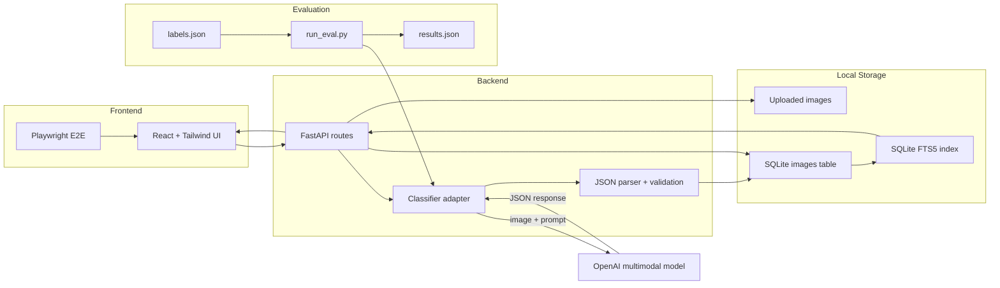

# Fashion Inspiration App

## Project Overview

This is a lightweight AI-powered fashion inspiration library for designers. Users can upload field inspiration images, let a multimodal model describe and classify the image, search and filter the image library, and add their own designer notes over time.

The project is built as a local proof of concept with:

- Frontend: React, Vite, TypeScript, Tailwind CSS
- Backend: Python, FastAPI
- Database: SQLite with FTS5 search
- Model: OpenAI multimodal model, configurable through `OPENAI_MODEL`

## Features

| Feature | Status | Notes |
| --- | --- | --- |
| Image upload and storage | [x] Done | Uploads local images and stores metadata in SQLite. |
| AI classification | [x] Done | Returns a natural-language description and structured fashion attributes. |
| Search | [x] Done | Uses SQLite FTS5 across AI output, location, designer tags, and designer notes. |
| Dynamic filters | [x] Done | Supports garment, style, color, pattern, material, occasion, consumer, location, time, and designer filters. |
| Designer annotations | [x] Done | Keeps human tags and notes separate from AI metadata. |
| Evaluation | [x] Done | Uses 70 manually reviewed Pexels images and reports per-field accuracy. |
| Testing | [x] Done | Includes parser tests, filter integration tests, and one upload/classify/filter E2E test. |

Current API endpoints:

```text
GET /api/health
POST /api/images
GET /api/images
GET /api/filters
PATCH /api/images/{image_id}/annotations
DELETE /api/images/{image_id}
```

## Architecture

```text
app/                    Application source
app/backend/            FastAPI app
app/backend/app/        Backend package, schema, classifier, and API routes
app/backend/uploads/    Local upload storage
app/frontend/           React + Tailwind app
app/frontend/e2e/       Playwright end-to-end tests
eval/                   Evaluation scripts, labels, images, and results
tests/backend/          Backend unit and integration tests
README.md               Setup, architecture notes, and evaluation summary
```

System architecture:



Upload flow:

```text
User uploads image
Backend saves file
Classifier returns description + structured attributes
SQLite stores image record and metadata
FTS5 index is updated
Frontend refreshes gallery and filters
```

Search uses SQLite FTS5. The backend stores a combined searchable text field in an `image_search` virtual table. That text includes AI description, structured AI attributes, location fields, designer name, designer tags, and designer notes. On upload, annotation update, or delete, the FTS index is synced. On startup, the index is rebuilt from existing image records.

## Setup

Create backend environment:

```bash
cd app/backend
python3 -m venv .venv
source .venv/bin/activate
pip install -r requirements.txt
```

Create `.env` from `.env.example` at the repo root:

```text
OPENAI_API_KEY=
OPENAI_MODEL=gpt-4.1-mini
DATABASE_PATH=app/backend/fashion.db
UPLOAD_DIR=app/backend/uploads
VITE_API_BASE_URL=http://localhost:8000
```

Start backend:

```bash
cd app/backend
source .venv/bin/activate
python -m uvicorn app.main:app --reload
```

Start frontend:

```bash
cd app/frontend
npm install
npm run dev
```

Open:

```text
http://localhost:5173
```

Run checks:

```bash
./app/backend/.venv/bin/python -m pytest
```

```bash
cd app/frontend
npm run build
npm run test:e2e
```

The E2E test starts its own backend and frontend servers on `127.0.0.1:8010` and `127.0.0.1:5174`, clears `OPENAI_API_KEY` for deterministic fallback classification, and runs with the locally installed Google Chrome browser.

## Key Design Decisions

| Decision | Why | Trade-off |
| --- | --- | --- |
| React + Vite | Simple interactive gallery without needing server-side rendering. | Less built-in app structure than Next.js. |
| Python + FastAPI | Easy API layer, Pydantic validation, and simple model/image scripting. | Not optimized for heavy background jobs without extra tooling. |
| SQLite | Fast local setup and enough for a small proof of concept. | Not meant for large multi-user production traffic. |
| SQLite FTS5 search | Better than Python string scanning and still local. | Not true semantic search and no weighted ranking yet. |
| `gpt-4.1-mini` | Good balance of quality, speed, and cost for visual classification. | Larger models may do better on subtle fields but cost more and may be slower. |
| Synchronous classification | Simple to build and easy to test in one day. | Slow classifier calls block the upload response. |
| Human designer notes | Captures context that AI may miss. | Notes can be subjective or sensitive, so future learning should require opt-in. |

The classifier can be swapped by changing `OPENAI_MODEL`. The prompt asks for strict JSON with a fixed schema and tells the model not to guess exact city, country, or continent from image content alone. The backend validates and normalizes model output before storage.

Images in the evaluation set are preprocessed with `eval/prepare_images.py`: renamed, resized to a maximum side length, converted to JPEG, and corrected for EXIF orientation. This keeps evaluation inputs consistent without removing useful visual detail.

Designer tags and notes are stored separately from AI metadata. They are already included in search. With user consent, they could later improve search ranking, label guidelines, evaluation, and prompt examples.

## Evaluation Summary

The evaluation uses 70 Pexels fashion images. Labels in `eval/labels.json` were manually reviewed. The script compares model output against expected fields and writes detailed results to `eval/results.json`.

Run:

```bash
./app/backend/.venv/bin/python eval/run_eval.py --labels eval/labels.json --images eval/images
```

Current results:

| Field | Accuracy | Notes |
| --- | ---: | --- |
| garment_type | 0.971 | Strong on visible garment categories. |
| occasion | 1.000 | Strong on broad use cases such as casual, formal, and workwear. |
| consumer_profile | 1.000 | Useful, but still subjective. |
| style | 0.957 | Good when labels allow multiple valid styles. |
| color_palette | 0.929 | Strong on dominant visible colors. |
| pattern | 0.897 | Good for obvious solid, striped, embroidered, and graphic patterns. |
| season | 0.794 | Scored with normalization such as autumn to fall. |
| material | 0.907 | Skips cases where material is visually unclear. |
| location_scene | 0.743 | Harder because scene labels are open-ended. |

Field notes:

- `occasion` scores well because the labels are broad, such as casual, formal, work, or vacation.
- `consumer_profile` also scores well, but it is subjective. I treat it as a merchandising hint, not a hard truth.
- `season` is lower because many images do not have strong visual season evidence. The prompt is intentionally conservative, so the model should avoid guessing when the image is unclear.
- `location_scene` improved after using shorter scene labels, but it is still harder than garment or color because scenes can be ambiguous.

Evaluation trade-offs:

| Area | Choice |
| --- | --- |
| Objective fields | Garment type, color, pattern, season, occasion, and scene are scored. |
| Subjective fields | Style, material, and consumer profile are scored but interpreted carefully. |
| Qualitative fields | Description and trend notes are reviewed manually, not exact-matched. |
| Location | Exact city and country are treated as user-provided context, not model targets. |
| Normalization | Season and scene aliases reduce false misses from small wording differences. |

## Limitations

- Upload classification is synchronous, so slow model responses delay the upload result.
- Search is keyword-based FTS, not semantic retrieval. It does not understand all synonyms.
- Search results are not ranked by field importance yet.
- The evaluation set is small and based on Pexels images, not private field research images.
- Style, trend, material, and consumer labels are partly subjective.
- The taxonomy is intentionally lightweight for the proof of concept.
- SQLite is good for local review, but a production app would need stronger storage and background processing.
- The app does not include authentication or multi-user permissions.

## Future Improvements

| Priority | Improvement | Good Standard |
| --- | --- | --- |
| 1 | Improve labels and evaluation | Clear label rules, more images, and a second reviewer for subjective fields. |
| 2 | Add async classification | Use `processing`, `ready`, and `failed` states so uploads do not block. |
| 3 | Add taxonomy normalization | Map model variants like `tee`, `t-shirt`, and `top` into controlled labels. |
| 4 | Add human review workflow | Let designers approve, edit, or reject AI metadata before using it as ground truth. |
| 5 | Add confidence scores and active learning | Flag low-confidence or disputed fields for review first. |
| 6 | Improve search | Add weighted ranking, typo tolerance, and embedding search for natural queries. |
| 7 | Compare models | Measure accuracy, latency, and cost on the same test set before switching models. |
| 8 | Scale image loading | Add thumbnails, pagination, and better lazy loading for larger libraries. |
| 9 | Use designer notes with consent | Improve search and model prompts from reviewed, opted-in human notes. |
| 10 | Product polish | Add bulk upload, clearer empty states, and better annotation workflows. |

The target is not perfect accuracy. A good result means objective fields are reliable enough for search, while subjective fields are clearly shown as AI suggestions that designers can refine.
